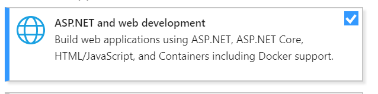

# Prerequisites

## Read

•  [Get started with Office Add-ins](https://docs.microsoft.com/en-us/office/dev/add-ins/)
•  [Office Open XML](https://github.com/OfficeDev/Open-Xml-Sdk)

## Install
•  Office 2016
•  Visual Studio
      •  ASP.NET and web development
      •  Office/SharePoint development
•  Git

## Have 
Office O365 Account
Please use the Office O365 Account which you got when you checked-in at the registration desk. We already prepared 3 sample files in OneDrive Files Folder.
