# Warm Up - Setup
In this module you will set up the solution and try the Office Add-ins ShareDataSite, which can pull in Text and Table contents from Office Word, Excel and PowerPoint. 

## Git Clone
git clone https://github.com/InteropEvents/ShareDataSite-OOXML-SDK.git
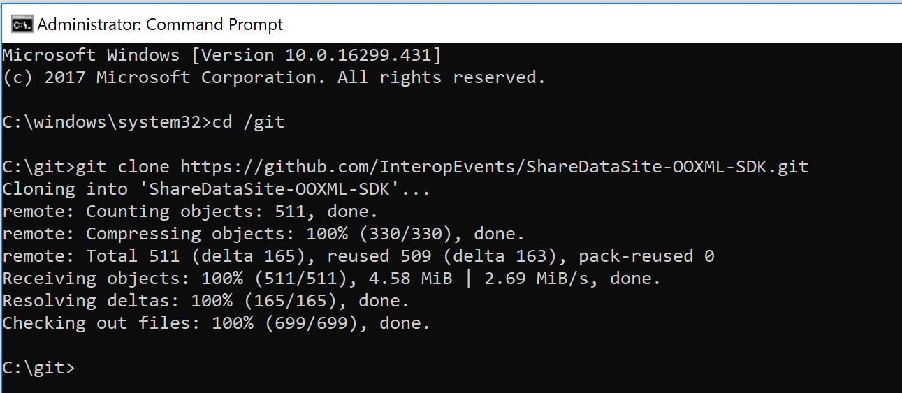

## Download the workshop code base
[Workshop code base](https://github.com/InteropEvents/ShareDataSite-OOXML-SDK/tree/master/workshop-code-base)

If you don't have Git installed, you can also choose "Download Zip".
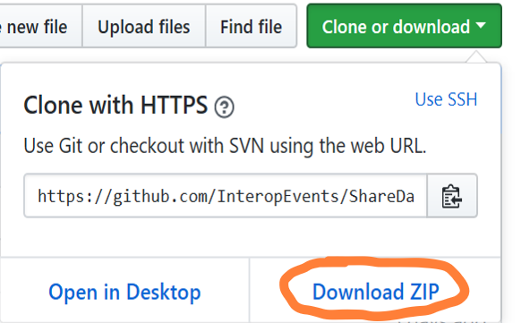

## Open ShareDataSite solution
Under your ShareDataSite-OOXML-SDK -> workshop-code-base -> ShareDataSite, use Visual Studio to open your ShareDataSite.sln.

## Set the multiple startup projects
Since we will use Office Word as the example, please right click ShareDataSite solution, go to "Properties" pages, then under "Multiple startup projects" set both WordAddin and ShareDateSite as startup project.

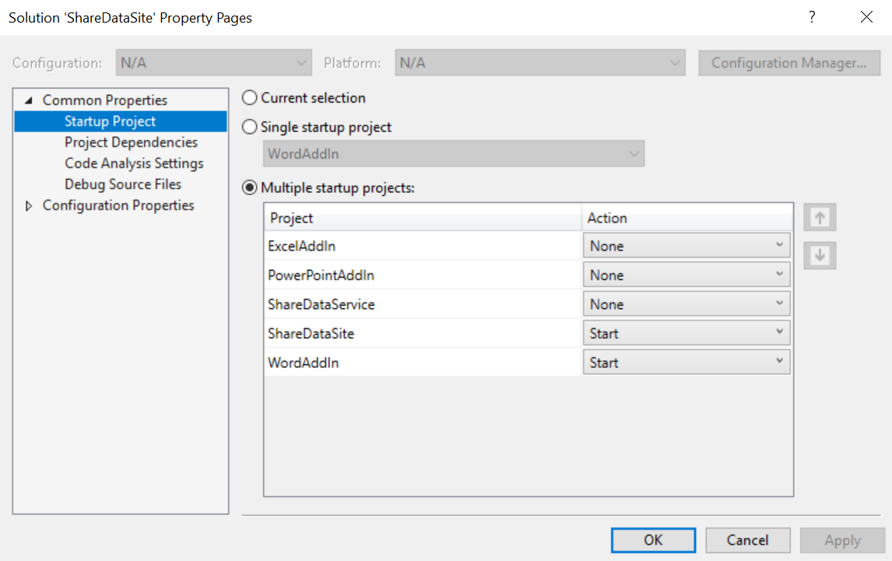

## Build the solution and Start Without Debugging
Build the solution in visual studio and Start Without Debugging, you might see these SecurityAlert and install a Certificate, please choose YES.
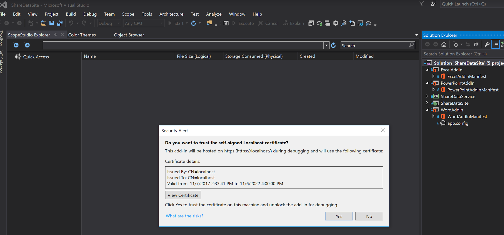
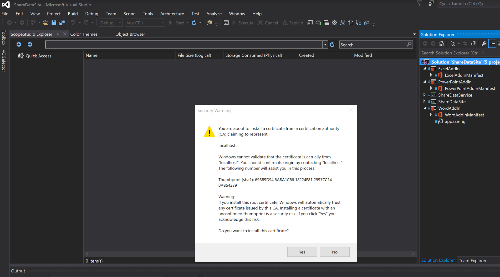

## Office Word will be started automatically, click "Show Taskpane"
You can see Office Word is started, then we wait for Office Add-ins loaded successfully, and click "Show Taskpane".
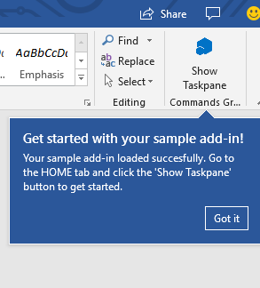

## About "Show Taskpane"
If you could not find "Show Taskpane", then navigate to "View" Menu and choose "Task Pane".
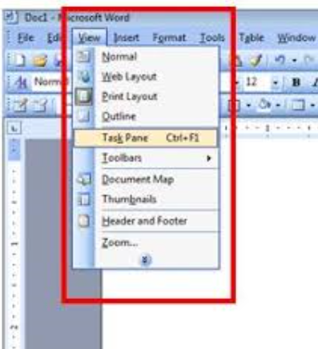

## Share Data Site Add-ins
Office Word is started, please click the Sign in button in the Task Pane.
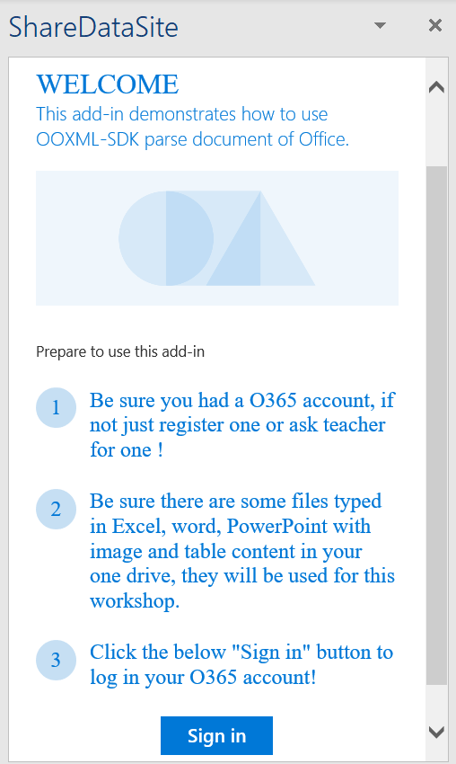

## Login in your Office O365 account
Please use the Office O365 Account which you got when you checked-in at the registration desk. For first time, an dialog will pop up asking if you allow ShareDataSite App to Access your data, please click "Accept".
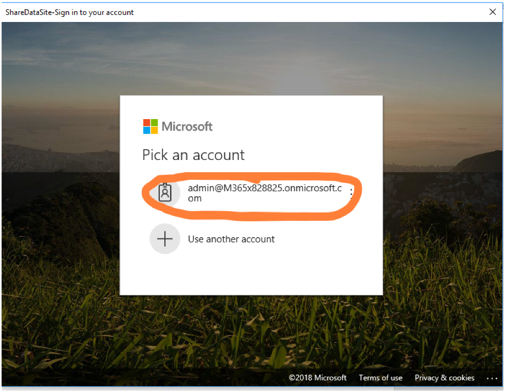
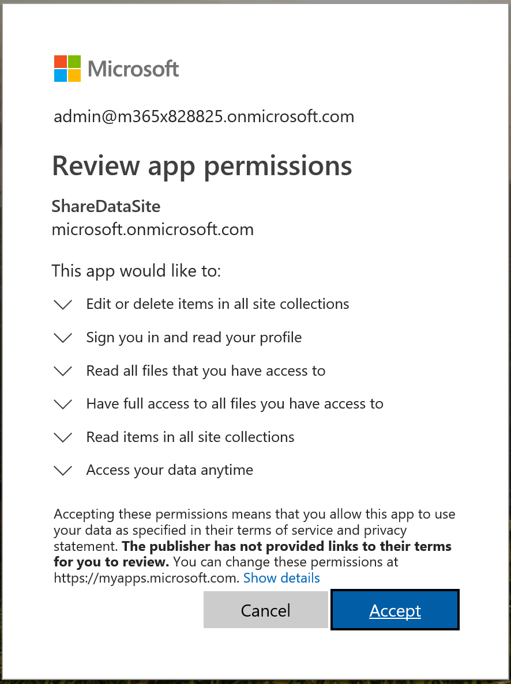

## Your Office O365 account OneDrive Files
We already prepared 3 sample files in OneDrive Files Folder for this Workshop. 
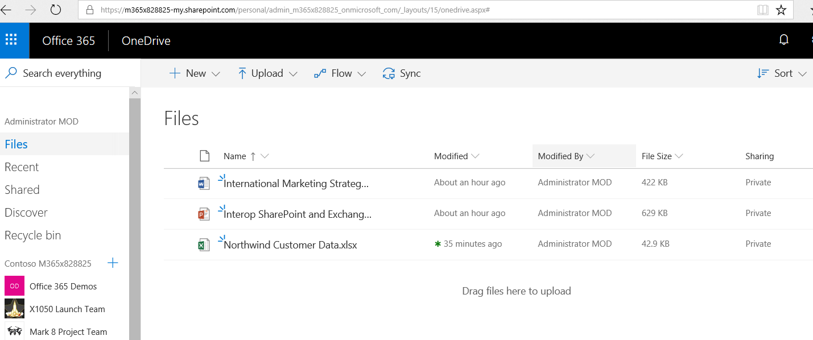

## Now ShareDataSite add-in shows up
After you login, you can see 3 sample files listed in the ShareDataSite Add-ins task pane.
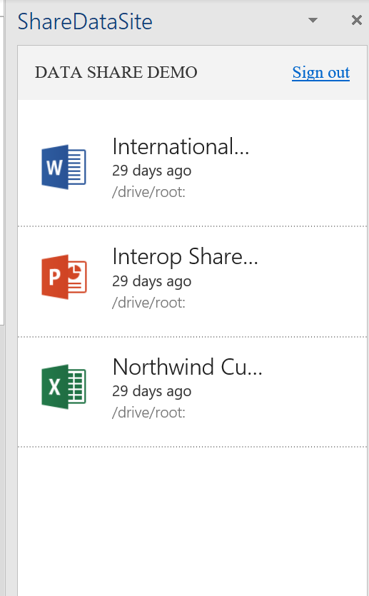

## Try to pull in Text and Table contents
Click the first Office Word document, and choose "Text", "Image" and "Table" options, then each type of content will show up. You can choose either one option or multiple options, Blue color Highlighted means you choose the option. You can try to pull in Text and Table contents. 
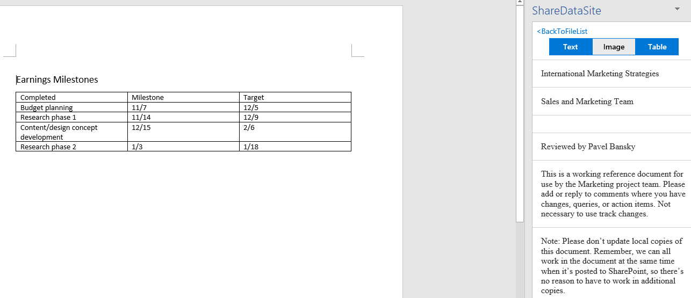

