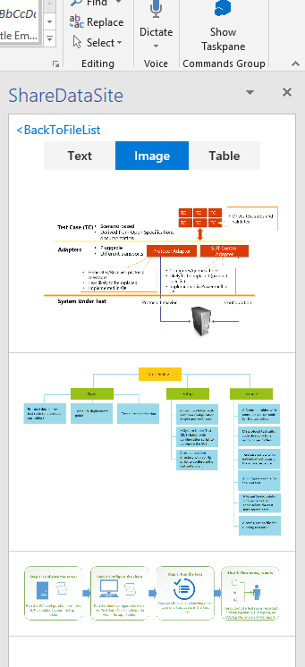
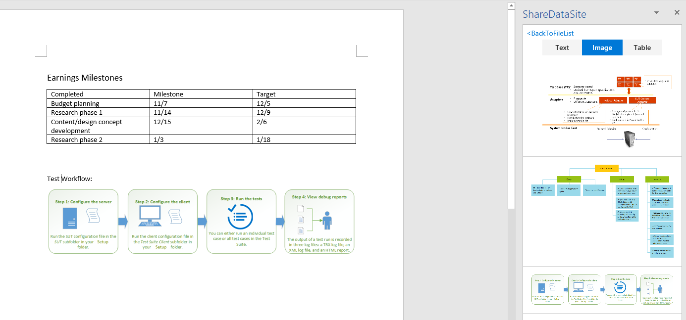

# Hand-on Workshop to pull in images from PowerPoint documents 

## Documentation for your reference:
See [Presentations (Open XML SDK)](https://docs.microsoft.com/en-us/office/open-xml/presentations) for documentation for the API.

## Add the following code to PowerPointParse.cs: 

//Loop through each slide and find ImageParts then add to the result.

        foreach (var slide in slideParts)
        {
            var images = slide.ImageParts.Select(
            m =>
            {               
                  var stream = m.GetStream();
                  var streamByteArray = new byte[stream.Length];
                  stream.Read(streamByteArray, 0, (int)stream.Length);
                  return new TempData { StorageType = StorageType.ImageType, Data = Convert.ToBase64String(streamByteArray) };
        
             });

             result.AddRange(images);
         }

## Build the solution in Visual Studio
Start Without Debuging and login in our O365 account, then you will find the images of the PowerPoint Document are now listed in the ShareDataSite Add-in taskpane.

## Now you can try to pull in images to the Word document.

