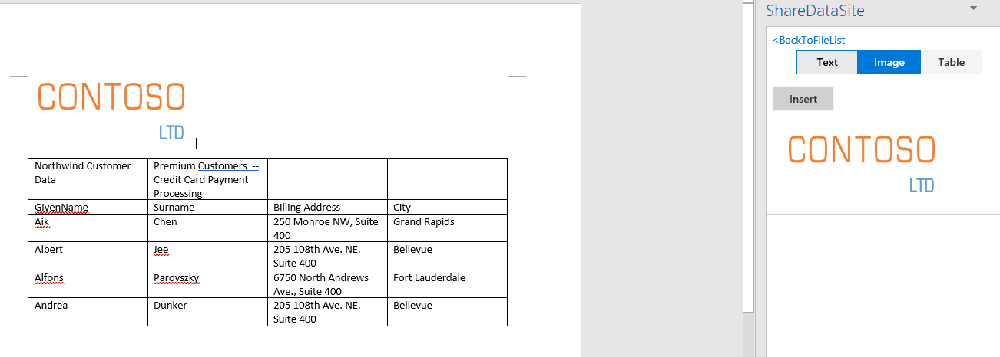

# Exercise to add code to pull in images from Word and Excel documents

## Sample code to WordParse.cs: 

                    // Find image and add to the result.
                    var imageParts = wordprocessingDocument.MainDocumentPart.ImageParts;
                    byte[] streamByteArray = null;
                    Stream stream = null;
                    foreach (ImagePart item in imageParts)
                    {
                        stream = item.GetStream();
                        streamByteArray = new byte[stream.Length];
                        stream.Read(streamByteArray, 0, (int)stream.Length);
                        result.Add(new TempData { StorageType = StorageType.ImageType, Data = Convert.ToBase64String(streamByteArray) });
                    }

## Sample code to ExcelParse.cs: 

                        
                        // Get all the images in the document.
                        if (worksheetPart.DrawingsPart != null && worksheetPart.DrawingsPart.ImageParts != null)
                        {
                            var imgs = worksheetPart.DrawingsPart.ImageParts.Select(m =>
                            {
                                stream = m.GetStream();
                                streamByteArray = new byte[stream.Length];
                                stream.Read(streamByteArray, 0, (int)stream.Length);
                                return new TempData { StorageType = StorageType.ImageType, Data = Convert.ToBase64String(streamByteArray) };
                            }).ToArray();
                            result.AddRange(imgs);
                        }                

## Then build the solution in Visual Studio, now the image contents show up for Word and Excel documents.

## You can pull in images from Word and Excel documents.

