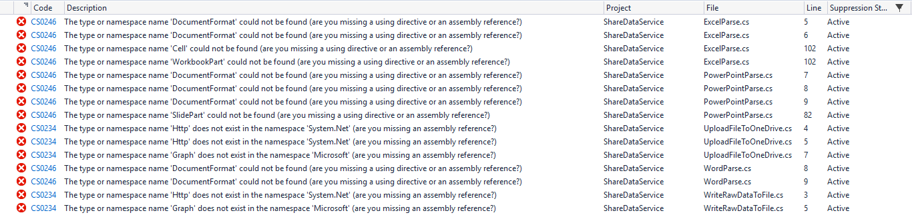
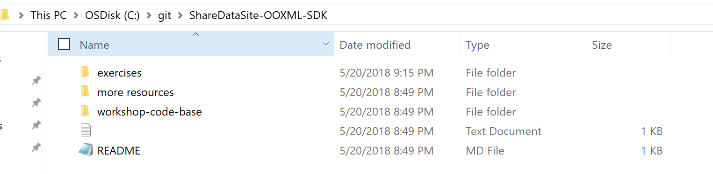

# FAQ

This is the FAQ document

## How to solve the below error while restoring NuGet packages. 
Error occurred while restoring NuGet packages: The specified path, file name, or both are too long. The fully qualified file name must be less than 260 characters, and the directory name must be less than 248 characters.

This is caused by the specified path too long. You can resolve it by shorting your local folder path where you just save this workshop project.
e.g. C:\git\ShareDataSite-OOXML-SDK

## How to solve the below error while loading the Office Add-in.
Error occurred after Office Add-in loaded:

To fix this error, we can remove then add back "ShareDataSite" in the dropdown list.

 